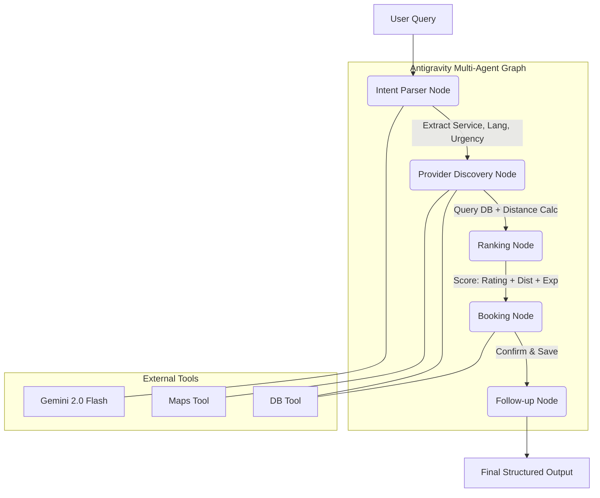

# 🛠️ Antigravity Service Orchestrator
### AI-Powered Orchestration for Pakistan's Informal Economy

[](https://google.com)
[](https://python.org)
[](https://langchain-ai.github.io/langgraph/)

## 📖 Overview
The **Antigravity Service Orchestrator** is a sophisticated multi-agent system designed to bridge the gap between informal service providers (AC technicians, plumbers, electricians, etc.) and customers in Pakistan. 

It handles complex natural language queries (English, Urdu, and Roman Urdu), discovers the best-verified providers based on location and rating, and automates the booking process—all while providing a transparent, step-by-step "Agent Trace" for the user.

## ✨ Key Features
- **Trilingual Support**: Expertly parses English, Urdu, and Roman Urdu (e.g., *"AC thanda nahi kar raha"*).
- **Intelligent Discovery**: Real-time provider lookup with distance calculation via Google Maps-style logic.
- **Multi-Criteria Ranking**: Ranks providers based on a weighted score of Rating, Distance, and Experience, adjusted by request urgency.
- **Transparent Reasoning**: Explains *why* a specific provider was chosen.
- **Detailed Agent Trace**: Judges and developers can see exactly how the AI moved from Intent → Discovery → Ranking → Booking.
- **Structured Output**: Clean, professional responses with clear booking and provider details.

## 🏗️ Project Architecture



## 🚀 Setup & Run

### Prerequisites
- Python 3.10+
- Google Gemini API Key

### Installation
1. Clone the repository:
   ```bash
   git clone <repo-url>
   cd informal-service-orchestrator
   ```

2. Create and activate a virtual environment:
   ```bash
   python -m venv .venv
   source .venv/bin/activate  # On Windows: .venv\Scripts\activate
   ```

3. Install dependencies:
   ```bash
   pip install -r requirements.txt
   ```

4. Configure environment variables:
   Create a `.env` file in the root:
   ```env
   GOOGLE_API_KEY=your_gemini_api_key_here
   PORT=8000
   ```

### Running the System
**Option 1: Terminal Test Suite (Recommended for Judges)**
Run the full workflow demo with multiple test cases:
```bash
python test_flow.py
```

**Option 2: FastAPI Server**
Start the API:
```bash
python main.py
```
Access docs at: `http://localhost:8000/docs`

## 📡 API Examples

### Create Service Request
**POST** `/requests/`
```json
{
  "user_id": "user_99",
  "raw_query": "Kitchen ka sink leak ho raha hai, emergency hai!",
  "location": {
    "address": "North Nazimabad, Karachi",
    "lat": 24.9333,
    "lng": 67.0333
  },
  "urgency": "high"
}
```

### Sample Response
```json
{
  "status": "success",
  "detected_intent": "plumber",
  "final_output": {
    "success": true,
    "message": "Behtreen! Waseem Akram aap ke kaam ke liye confirm ho gaye hain...",
    "booking_details": {
      "booking_id": "BK-1715794285",
      "status": "confirmed",
      "total_estimated_cost": "PKR 2000.0/hr"
    },
    "provider_details": {
      "name": "Waseem Akram",
      "rating": 4.9,
      "distance": "0.5 km"
    },
    "reasoning_summary": "Chosen Waseem Akram because they have a 4.9 star rating..."
  }
}
```

## 🌌 How We Used Google Antigravity
This project leverages **Google Gemini 2.0 Flash** and **LangGraph** to create a reliable service orchestration layer:
1. **Orchestration**: We used a state-based graph to ensure the agent follows a strict, predictable path while remaining flexible in natural language understanding.
2. **Tools**: Custom tools were built for Database interaction and Mock Maps calculation, simulating a real-world production environment.
3. **Traceability**: Every node execution is logged into a `trace` field, allowing for high-quality debugging and judge verification of the AI's internal logic.
4. **Resilience**: The system uses structured JSON extraction with re-try logic to ensure the LLM output is always usable by the backend.

## 👥 Team Contribution
- **AI Orchestration**: Built the multi-agent graph logic using LangGraph and Gemini.
- **Backend Infrastructure**: FastAPI setup, Pydantic modeling, and mock database integration.
- **Frontend/API Design**: Structured response formatting and Roman Urdu localization.

---
*Built for the Google Antigravity Hackathon Challenge 2.*
